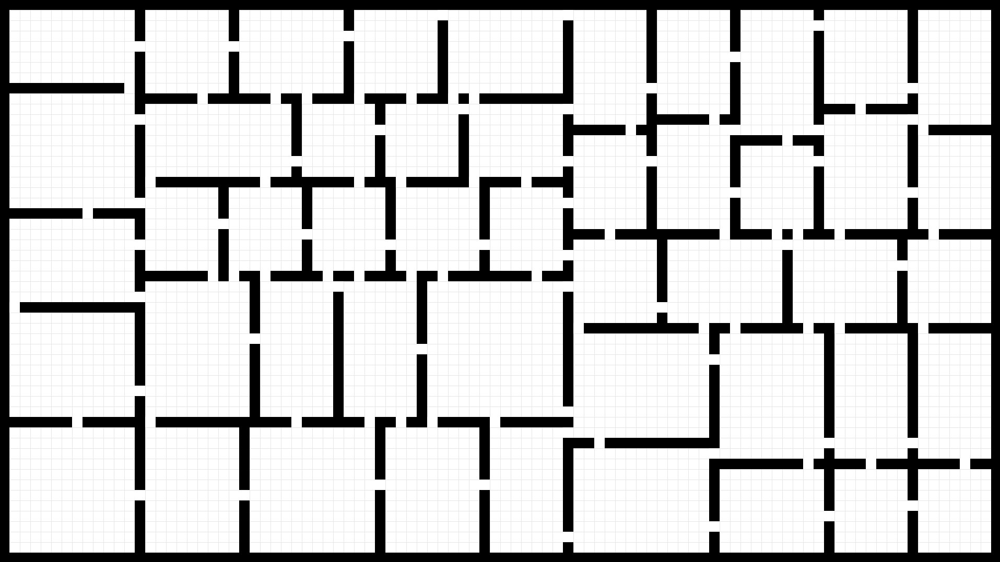
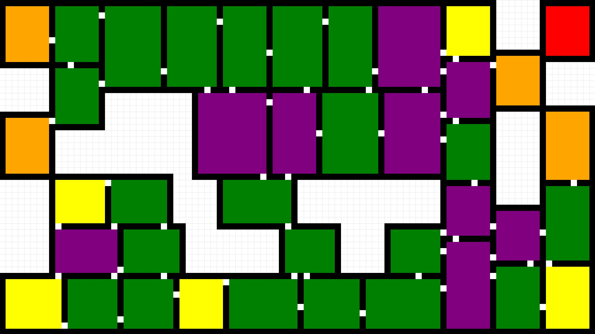
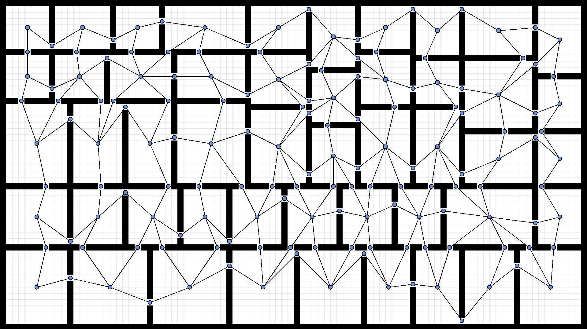
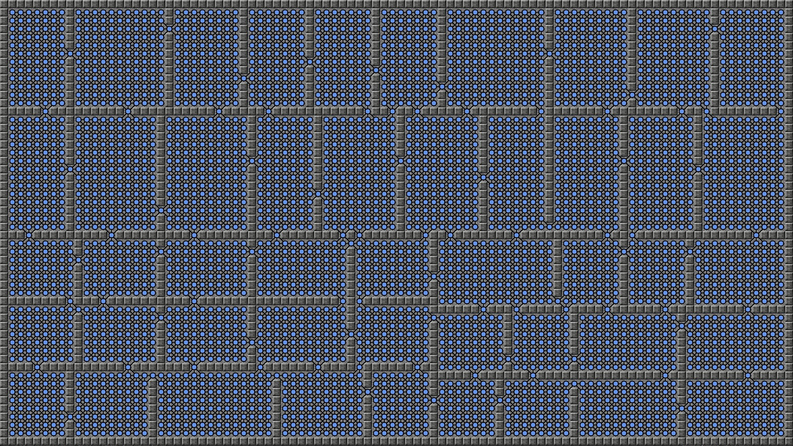
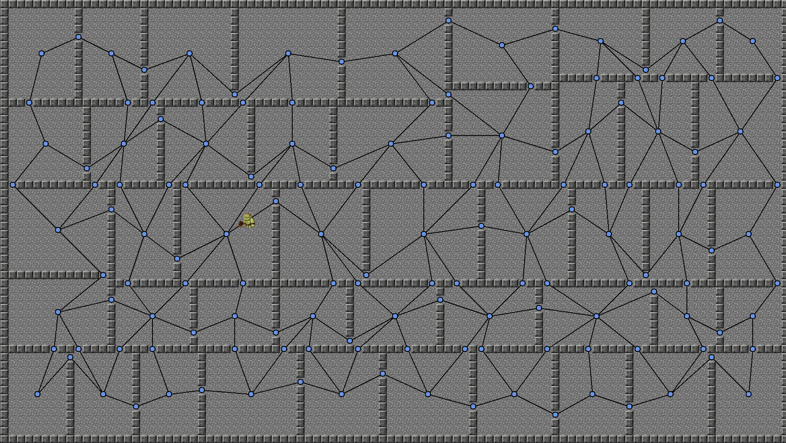
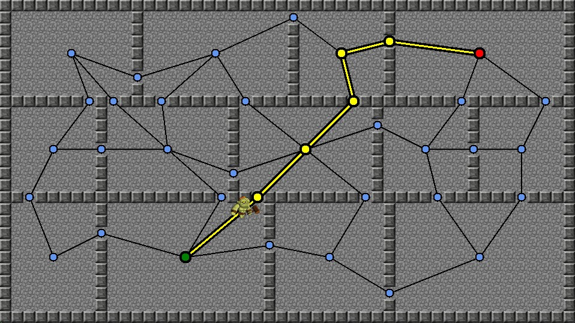
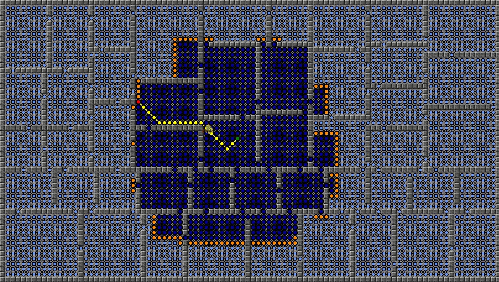
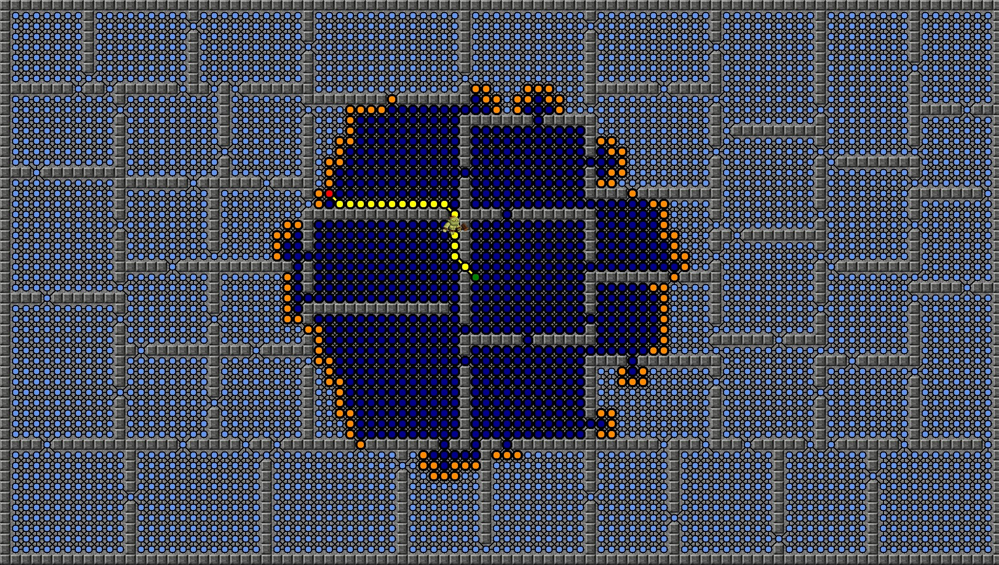
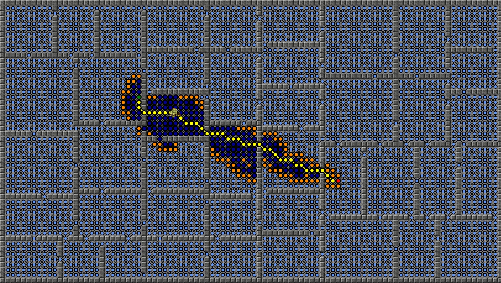

# Dungeon generation and Pathfinding demo

A project I worked on during my Algorithms course, which showcases various algorithms for dungeon generation and path finding.

   
  *<i>Low frame rate caused by gif limitations</i>*

## Overview

Throughout the course, we covered many fundamental algorithms and techiniques for solving common programming problems - from generating a dungeon with Binary Space Partitioning (BSP) to finding shorthest paths with the A* pathfinding algorithm. All done utilizing the [GXP 2D Game Engine](https://github.com/zntKI/AlgorithmsAssignment/tree/main/gxpengine) - a code-based small engine designed and developed by the teachers to introduce students to how a game engine may opperate.

## Features

###  Room splitting  

   

###  Room splitting(Additional)  

  *<i>Removes the biggest and smallest room/s and colors them by the number of connections(doors) they have</i>* 
   

###  Node generation  

   

###  Node Generation with Tiled View  

  *<i>Generates a node for every walkable tile and links it to its neigbouring</i>* 
   

###  Random Player Movement  

  *<i>Player picks nodes randomly until it reaches its destination</i>* 
   

###  Recursive Shortest(Node count) Pathfinding  

  *<i>Recursively searches through <b>all<b/> nodes to make sure that the shortest path was found</i>* 
   

###  BFS Shortest(Node count) Pathfinding  

  *<i>Equally expands from the origin in the form of a square, searching for the destination</i>* 
   

###  Dijkstra Shortest(Distance) Pathfinding  

  *<i>Equally expands from the origin in the form of a circle, searching for the destination</i>* 
   

###  A* Shortest(Distance/Node count) Pathfinding  

  *<i>Combines both Dijkstra and Greedy search strategies to form a near perfect balance between accuracy and efficiency</i>* 
   

